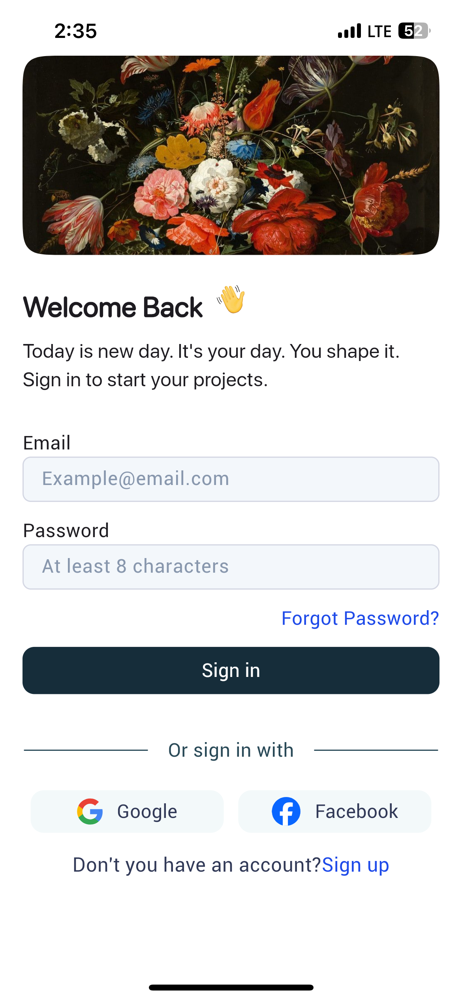
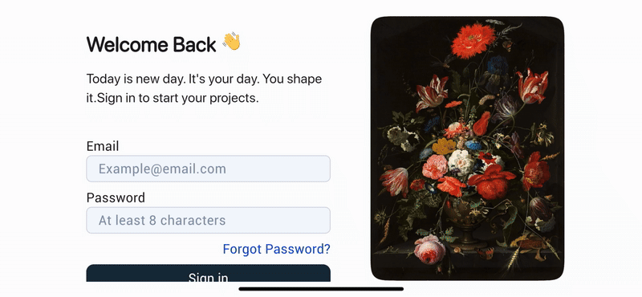

<h1 align="center">📱 Responsive Login App / Web</h1>

<em>A truly adaptive and cross-platform responsive login UI built using Flutter</em>

---

<h2>🚀 Overview</h2>

This application demonstrates a <strong>fully responsive login interface</strong> that intelligently adapts its layout based on the platform (Android, iOS, Windows, Linux, Web) and device orientation (portrait/landscape).

The UI dynamically scales paddings, font sizes, image banners, and input elements based on:

<ul>
  <li><code>MediaQuery</code> screen dimensions</li>
  <li>Platform type via <code>DeviceDetector</code></li>
  <li>Screen orientation using <code>ScreenMode</code></li>
</ul>

<h2>🛠 Features</h2>
<ul>
  <li>🔄 Adaptive layout using <code>adaptive_linear_layout</code></li>
  <li>📱 Works across Android, iOS, Web, Windows, Linux</li>
  <li>🌗 Handles portrait & landscape orientations</li>
  <li>🎨 Smooth image cards & background via <code>figma_squircle</code></li>
  <li>📷 Dynamic image banner switching via <code>SliderIndex</code></li>
  <li>🔗 Google / Facebook sign-in buttons</li>
  <li>🧠 Smart scaling for input fields and font sizes</li>
</ul>

---

<h2>📦 Cross Platform Builds</h2>

<ul>
  <li>📱 <strong>Android:</strong> <a href="https://raw.githubusercontent.com/Shanu33/responsive_login_app/main/resources/app-release.apk">Download APK</a></li>
  <li>🪟 <strong>Windows:</strong> <a href="https://github.com/Shanu33/responsive_login_app/raw/refs/heads/main/resources/responsive_login_app.exe">Download EXE</a></li>
  <li>🐧 <strong>Linux:</strong> <a href="https://raw.githubusercontent.com/Shanu33/responsive_login_app/main/resources/responsive_login_app">Download Executable</a></li>
  <li>🌐 <strong>Web:</strong> <a href="https://shanu33.github.io/responsive_login_app/">Click here to open the website</a></li>
  <li>🍏 <strong>iOS/macOS:</strong> Download the ZIP and build it manually for the platform.</li>
</ul>

---

<h2>📐 Responsive Design Demonstration</h2>

<h3>🖥️ Desktop</h3>
<ul>
  <li><strong>Portrait View:</strong> 
    <table cellspacing="0" cellpadding="0" style="border-collapse: collapse;">
      <tr>
        <td style="border: 2px solid black; border-radius: 8px; padding: 0;">
          
        </td>
      </tr>
    </table>
  </li>

  <li><strong>Landscape View:</strong> 
    <table cellspacing="0" cellpadding="0" style="border-collapse: collapse;">
      <tr>
        <td style="border: 2px solid black; border-radius: 8px; padding: 0;">
          
        </td>
      </tr>
    </table>
  </li>
</ul>

<h3>📱 Mobile</h3>
<ul>
  <li><strong>Portrait View:</strong> 
    <table cellspacing="0" cellpadding="0" style="border-collapse: collapse;">
      <tr>
        <td style="border: 2px solid black; border-radius: 8px; padding: 0;">
          
        </td>
      </tr>
    </table>
  </li>

  <li><strong>Landscape View:</strong> 
    <table cellspacing="0" cellpadding="0" style="border-collapse: collapse;">
      <tr>
        <td style="border: 2px solid black; border-radius: 8px; padding: 0;">
          
        </td>
      </tr>
    </table>
  </li>
</ul>

---

<h2>🧩 Technology Stack</h2>
<ul>
  <li>Flutter + Dart</li>
  <li>adaptive_linear_layout</li>
  <li>platform_screener</li>
  <li>figma_squircle</li>
  <li>flutter_svg</li>
</ul>

---

<h2>🔧 Core Logic</h2>

The layout adapts using:

<ol>
  <li><code>customSize()</code> – Computes dimensions and font sizes based on orientation and platform</li>
  <li><code>DeviceDetector</code> – Distinguishes Android, iOS, Web, and Desktop</li>
  <li><code>ScreenMode</code> – Distinguishes landscape vs portrait</li>
  <li>Conditional padding, font size, and visibility of elements based on screen state</li>
</ol>

---

<h2>📷 UI Highlights</h2>
<ul>
  <li>🌺 Beautiful image banner that slides on tap</li>
  <li>👋 Welcome header with animated GIF</li>
  <li>📩 Email & password input fields with rounded borders</li>
  <li>🔗 Hyperlink for forgotten passwords</li>
  <li>🖱 Google & Facebook sign-in buttons with SVG icons</li>
  <li>🆕 Sign up call-to-action at the bottom</li>
</ul>

---

<h2>🙏 Credits</h2>

  Special thanks to <strong><a href="https://www.figma.com/@MMarwan?fuid=1518655903515858290">Marwan</a></strong> 
  for the original <a href="https://www.figma.com/design/Q9MAaLfWaffLHsjQlKY2ey/Login-Page--Community-">Login UI Template on Figma</a>. 
  This layout and logic was inspired by his beautiful design work 💙

